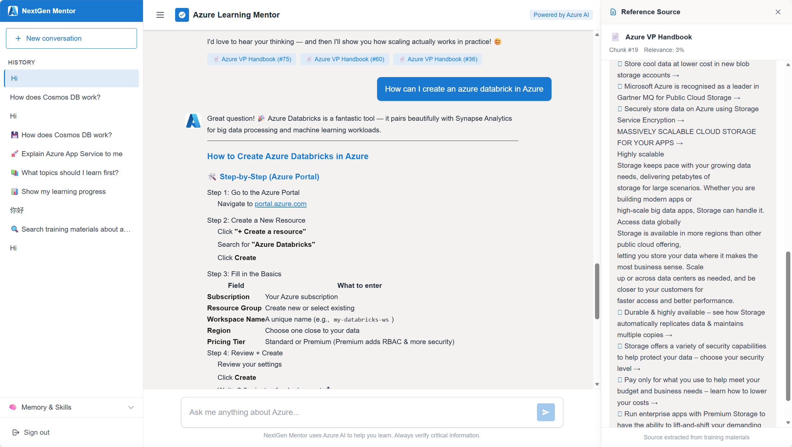
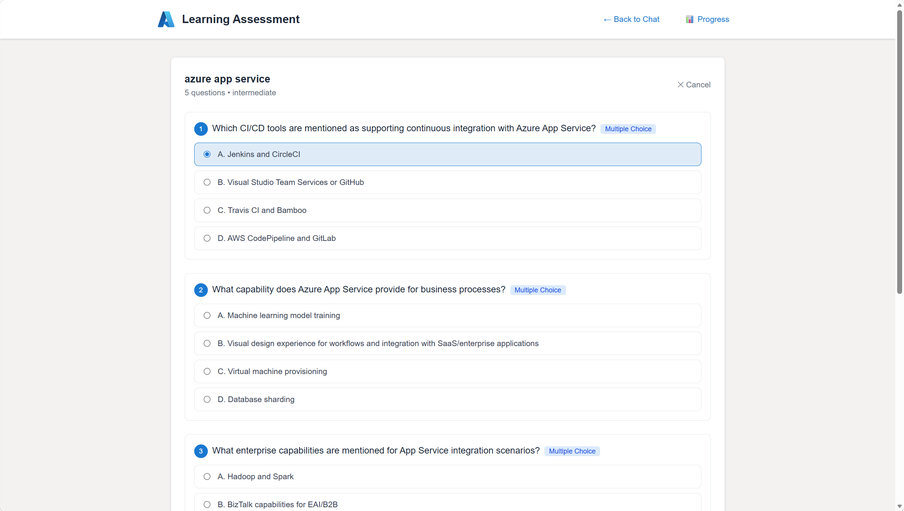
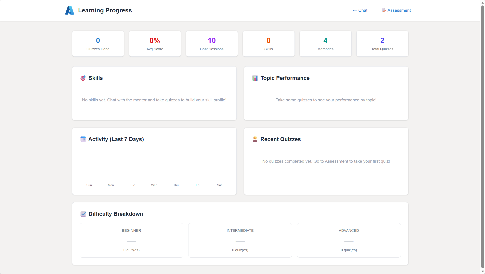

# NextGen Mentor 🎓

An AI-powered virtual mentor that automates onboarding training, knowledge Q&A, and learner assessment using RAG (Retrieval-Augmented Generation) and Azure AI services.


## 🌟 Features

### 💬 AI Chat with RAG
- Retrieval-Augmented Generation powered by Claude and Azure AI Search
- Upload training materials (PDF/TXT/MD) → automatic chunking → vector embeddings → semantic retrieval
- Responses grounded in source documents with clickable citation panel showing original text
- Streaming responses for real-time interaction

### 📝 Smart Assessment
- Auto-generated quizzes from training materials
- **Mixed question types**: Multiple Choice + Open-ended questions
- AI-powered grading for open-ended answers with personalized feedback
- Configurable difficulty levels (Beginner / Intermediate / Advanced)
- Model answers and key points provided after submission

### 🧠 Learning Memory
- Persistent context memory across sessions
- AI automatically identifies and records learning progress
- One-click skill summarization from learning history
- Personalized responses based on learner profile

### 📊 Progress Dashboard
- Real-time learning analytics
- Skills tracking with proficiency levels
- Topic performance breakdown
- 7-day activity timeline
- Difficulty-level statistics
- Quiz history and score trends

## 🏗️ Architecture

```
┌─────────────────────────────────────────────────────────┐
│                    Frontend (Next.js)                     │
│         TypeScript + Tailwind CSS + React                │
├─────────────────────────────────────────────────────────┤
│                         Nginx                            │
│              Reverse Proxy + SSL (Cloudflare)            │
├─────────────────────────────────────────────────────────┤
│                   Backend (FastAPI)                       │
│    Auth │ Chat │ RAG │ Assessment │ Memory │ Progress    │
├────────────┬────────────────┬───────────────────────────┤
│  Claude    │  Azure AI      │    Azure Cosmos DB        │
│  (LLM)    │  Search        │    (NoSQL, Serverless)    │
│            │  (Vector Index)│                           │
└────────────┴────────────────┴───────────────────────────┘
```

## 🛠️ Tech Stack

| Layer | Technology |
|-------|-----------|
| **Frontend** | Next.js 16, TypeScript, Tailwind CSS, React Markdown |
| **Backend** | FastAPI, Python 3.10+, Uvicorn |
| **LLM** | Claude (Anthropic-compatible API) |
| **Vector Search** | Azure AI Search (HNSW vector index + hybrid search) |
| **Database** | Azure Cosmos DB for NoSQL (Serverless) |
| **Auth** | JWT (python-jose) + bcrypt |
| **Deployment** | Ubuntu VM, Nginx, Cloudflare DNS + SSL |

## 📁 Project Structure

```
nextgen-mentor/
├── backend/                 # FastAPI backend
│   ├── app/
│   │   ├── main.py         # FastAPI app entry
│   │   ├── config.py       # Settings management
│   │   ├── database.py     # Cosmos DB client
│   │   ├── rag.py          # RAG pipeline (chunk, embed, search)
│   │   ├── memory.py       # Learner memory system
│   │   └── routers/
│   │       ├── auth.py     # Registration, login, JWT
│   │       ├── chat.py     # Chat with RAG + streaming
│   │       ├── documents.py # Document upload & indexing
│   │       ├── assessment.py # Quiz generation & grading
│   │       ├── memory.py   # Memory CRUD & skill extraction
│   │       └── progress.py # Learning analytics
│   ├── requirements.txt
│   └── .env.example
├── frontend/                # Next.js frontend
│   ├── src/app/
│   │   ├── page.tsx        # Main chat UI
│   │   ├── assessment/     # Quiz page
│   │   └── progress/       # Dashboard page
│   ├── public/
│   └── .env.local.example
├── docs/
│   └── PRD.md              # Product Requirements Document
└── README.md
```

## 🚀 Getting Started

### Prerequisites

- Python 3.10+
- Node.js 18+
- Azure AI Search instance
- Azure Cosmos DB instance (Serverless recommended)
- Anthropic-compatible LLM API endpoint

### Backend Setup

```bash
cd backend
python3 -m venv venv
source venv/bin/activate
pip install -r requirements.txt

# Configure environment
cp .env.example .env
# Edit .env with your Azure credentials

# Run
uvicorn app.main:app --host 0.0.0.0 --port 8000
```

### Frontend Setup

```bash
cd frontend
npm install

# Configure environment
cp .env.local.example .env.local
# Edit .env.local

# Development
npm run dev

# Production
npm run build && npm start
```

### Nginx Configuration (Production)

```nginx
server {
    listen 80;
    server_name your-domain.com;

    location / {
        proxy_pass http://127.0.0.1:3000;
        proxy_http_version 1.1;
        proxy_set_header Upgrade $http_upgrade;
        proxy_set_header Connection 'upgrade';
        proxy_set_header Host $host;
    }

    location /api/ {
        proxy_pass http://127.0.0.1:8000/api/;
        proxy_buffering off;  # Important for SSE streaming
        proxy_cache off;
        proxy_read_timeout 300s;
    }
}
```

## 📡 API Endpoints

| Method | Endpoint | Description |
|--------|----------|-------------|
| POST | `/api/auth/register` | User registration |
| POST | `/api/auth/login` | User login (returns JWT) |
| GET | `/api/auth/me` | Get current user |
| POST | `/api/chat` | Send message (SSE streaming) |
| GET | `/api/chat/sessions` | List chat sessions |
| POST | `/api/documents/upload` | Upload document for RAG |
| GET | `/api/documents` | List documents |
| POST | `/api/assessment/generate` | Generate quiz |
| POST | `/api/assessment/submit` | Submit & grade quiz |
| GET | `/api/assessment/quizzes` | List quizzes |
| GET | `/api/memory` | Get learner memory |
| POST | `/api/memory/summarize` | AI summarize to skills |
| GET | `/api/progress/me` | Get progress dashboard |

## 🔑 Environment Variables

### Backend (.env)
```env
ANTHROPIC_BASE_URL=https://your-llm-endpoint
ANTHROPIC_AUTH_TOKEN=your-token
ANTHROPIC_MODEL=claude-opus-4.6

AZURE_SEARCH_ENDPOINT=https://your-search.search.windows.net
AZURE_SEARCH_KEY=your-admin-key

COSMOS_DB_ENDPOINT=https://your-db.documents.azure.com:443/
COSMOS_DB_KEY=your-key
COSMOS_DB_DATABASE=nextgen-mentor

JWT_SECRET=your-secret
JWT_EXPIRE_HOURS=24
```

### Frontend (.env.local)
```env
NEXT_PUBLIC_API_URL=  # Empty for same-origin (nginx proxy)
```

## 📸 Screenshots

### Chat Interface with RAG & Citations


### Learning Assessment (MCQ + Open-ended)


### Progress Dashboard


## 🙏 Acknowledgments

- [Azure AI Search](https://azure.microsoft.com/en-us/products/ai-services/ai-search) for vector search
- [Azure Cosmos DB](https://azure.microsoft.com/en-us/products/cosmos-db) for serverless database
- [Anthropic Claude](https://www.anthropic.com/) for LLM capabilities
- [Next.js](https://nextjs.org/) for the React framework
- [FastAPI](https://fastapi.tiangolo.com/) for the Python backend

## 📄 License

MIT License - see [LICENSE](LICENSE) for details.
